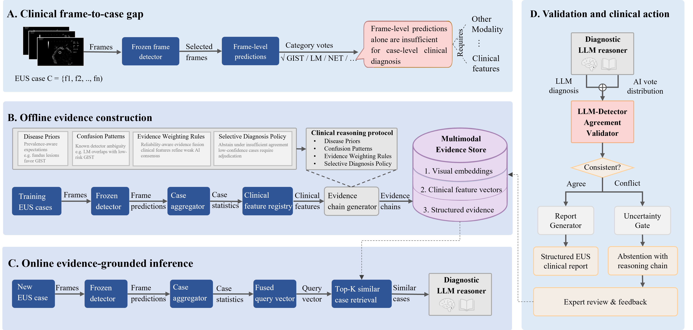

<p align="center">
  
</p>

<p align="center">
  
  
  
</p>

**Evidence-grounded uncertainty detection for case-level EUS diagnosis — without retraining the underlying detector.**

MEA (Multimodal Evidence Alignment) identifies cases where frame-level AI predictions
are likely erroneous in endoscopic ultrasound (EUS) diagnosis. It wraps a frozen
frame-level detector with multimodal evidence retrieval, protocol-constrained LLM
reasoning, and cross-model agreement validation. When the LLM diagnosis conflicts
with the detector vote, MEA abstains and recommends expert review; when they agree,
MEA produces a structured, auditable diagnostic report with explicit evidence chains
and differential diagnoses.

Evaluated on 528 multicenter EUS cases across five SMT subtypes, MEA achieves
uncertainty detection F1 of 71.5%, with 95.3% diagnostic accuracy at 71.8% coverage.

## Installation

```bash
pip install -e .
```

Requirements: Python ≥ 3.9, numpy, scipy, pyyaml.

## LLM Configuration

MEA requires an LLM for evidence-grounded reasoning.
Configure it via `configs/llm_config.yaml`:

```yaml
provider: siliconflow
model: deepseek-ai/DeepSeek-V4-Flash
temperature: 0.1
```

**API keys are never stored in the config file.** Set them via environment variables:

```bash
export SILICONFLOW_API_KEY=sk-xxx    # for SiliconFlow
export DEEPSEEK_API_KEY=sk-xxx       # for DeepSeek direct
```

Then use:

```python
from harness.llm_client import LLMClient

# Auto-loads from configs/llm_config.yaml + env var
llm = LLMClient.from_config()

# Or with overrides
llm = LLMClient.from_config(temperature=0.3)
```

## Quick Start

```bash
# 1. Build an evidence index from your dataset
mea build-index --data ./my_dataset/ --output index.json

# 2. Evaluate using the index
mea evaluate --data ./my_dataset/ --index index.json --output results.json

# 3. Inspect your feature registry
mea show-config
```

## Programmatic API

```python
from harness import MultimodalEvidenceAlignment
from harness.registry.feature import FeatureRegistry

# Extract clinical features
registry = FeatureRegistry("configs/feature_registry.yaml")
features = registry.extract_all("./my_dataset/CASE-001/")

# Run full analysis
mea = MultimodalEvidenceAlignment()
result = mea.run_online(
    case_id="CASE-001",
    llm_diagnosis="GIST",
    detector_vote="GIST",
    confidence=0.85,
    reasoning="...",
)
print(result.uncertain)  # False = diagnosis issued
```

## Key Features

- **Uncertainty detection** — identifies cases where frame-level predictions are likely erroneous (F1 71.5%)
- **Selective diagnosis** — 95.3% accuracy at 71.8% coverage; abstains when evidence is insufficient
- **Audit trail** — complete reasoning chain from frame predictions to final diagnosis
- **Multimodal retrieval** — similar case retrieval via fused vision (4096d) + text (1024d) embeddings
- **Extensible** — add new clinical features, validators, or extractors via YAML config
- **No retraining required** — works on top of any frozen frame-level detector

## Architecture



## Documentation

- [Quick Start](docs/quickstart.md)
- [Data Format](docs/data-format.md)
- [Extending MEA](docs/extending.md)
- [Architecture](docs/architecture.md)

## License

MIT. See [LICENSE](LICENSE).
